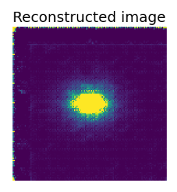
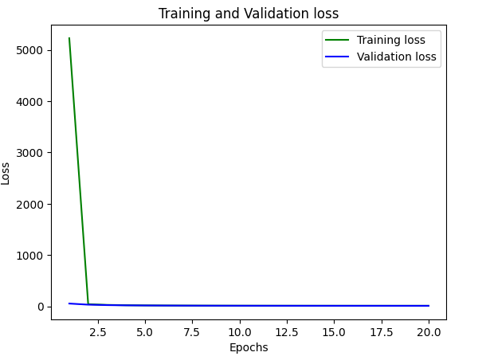

# ML4SCI GSOC GENIE Task
## Common Task 1. Auto-encoder of the quark/gluon events

At the LHC, a bunch of protons are accelerated and made to collide with each other which produces constituent particles. The set of scattered particles are called jets and snapshots of jets are called jet images. Now, we cannot save every such image as the collision frequency is extremely high and we have limited storage capacity. Another issue that we deal with is finding anomalies in such jet images. If the anomalies is something out of the standard known theory we may not be able to identify them.

Thus, We use Autoencoders which are a class of neural networks that learn the inherent pattern of the data and represent it in lower dimensions. This can be used to compress the original image and once it learns the structure of the image if it is shown something different it will fail at representing it in a lower dimension. This failure to compress can be quantified using a reconstruction loss and when this loss crosses a certain threshold we can identify the image as an anomalous image.

## Task 
1. Train an auto-encoder to learn the representation based on three image channels (ECAL, HCAL and Tracks) for the dataset.
2. Show a side-by-side comparison of original and reconstructed events.

## Training and result
The data set was trained on a VAE architecture with the following parameters:
```
Learning Rate: 3e-4
Optimizer: Adam
Epochs: 20
```
### Result:

 

### Performance

Mode  | Loss
------------- | -------------
Train  | 9.8182
Validation | 9.6419



## Discussion

As it can be seen from above the generated images are not very good. So reasons for that can be:

1. Since this is not typical RGB data the model does not behave in a way that it would for RGB data.
2. Although traditional transformations can be applied there is not much difference. For Example, Rotating an image won't do us any good as the data is kind of rotation invariant. Similar for other transformations.
3. Since all of the dataset wasn't used so the training wasn't perfect. There may be a scope of Overfitting.
4. The hyperparameters may not be right.

Ways to improve the model:

1. Other Architectures need to be explored such as VQ-VAE or Beta-VAE.
2. The hyperparameters should be tuned more.
3. Other Generative models can be used to learn the representation such as Diffusion model etc.
4. Since the images are not the typical RGB images and based on research converting them to graphs and applying Graph VAE may yield better results.
